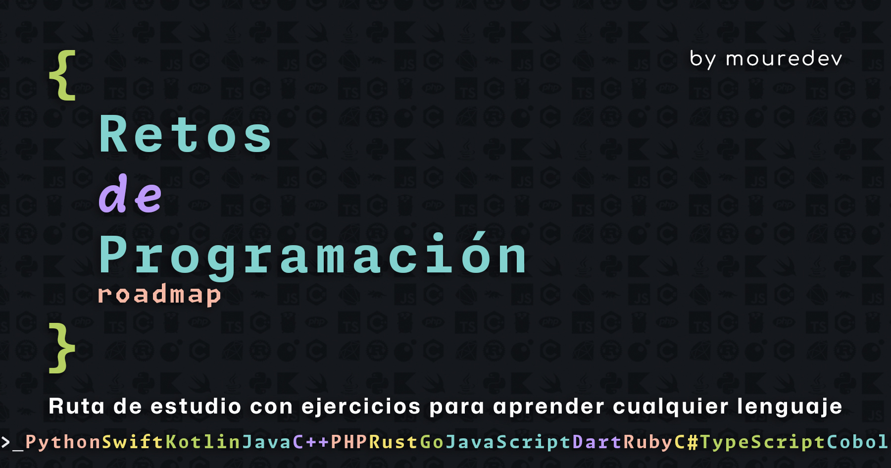

# Roadmap retos de programación semanales 2024

## Roadmap

| #   | Ejercicio                                                                                                                                          | Corrección                                                                                                 | Vídeo                              | Comunidad                                                                                |
| --- | -------------------------------------------------------------------------------------------------------------------------------------------------- | ---------------------------------------------------------------------------------------------------------- | ---------------------------------- | ---------------------------------------------------------------------------------------- |
| 00  | [SINTAXIS, VARIABLES, TIPOS DE DATOS Y HOLA MUNDO](./Roadmap/00%20-%20SINTAXIS,%20VARIABLES,%20TIPOS%20DE%20DATOS%20Y%20HOLA%20MUNDO/ejercicio.md) | [📝](./Roadmap/00%20-%20SINTAXIS,%20VARIABLES,%20TIPOS%20DE%20DATOS%20Y%20HOLA%20MUNDO/python/mouredev.py) | [▶️](https://youtu.be/gEIBJ7rmLa0) | [👥](./Roadmap/00%20-%20SINTAXIS,%20VARIABLES,%20TIPOS%20DE%20DATOS%20Y%20HOLA%20MUNDO/) |
| 01  | [OPERADORES Y ESTRUCTURAS DE CONTROL](./Roadmap/01%20-%20OPERADORES%20Y%20ESTRUCTURAS%20DE%20CONTROL/ejercicio.md)                                 | [📝](./Roadmap/01%20-%20OPERADORES%20Y%20ESTRUCTURAS%20DE%20CONTROL/python/mouredev.py)                    | [▶️](https://youtu.be/DLSGCh9jdes) | [👥](./Roadmap/01%20-%20OPERADORES%20Y%20ESTRUCTURAS%20DE%20CONTROL/)                    |
| 02  | [FUNCIONES Y ALCANCE](./Roadmap/02%20-%20FUNCIONES%20Y%20ALCANCE/ejercicio.md)                                                                     | [📝](./Roadmap/02%20-%20FUNCIONES%20Y%20ALCANCE/python/mouredev.py)                                        | [▶️](https://youtu.be/auxClgiX6UM) | [👥](./Roadmap/02%20-%20FUNCIONES%20Y%20ALCANCE/)                                        |
| 03  | [ESTRUCTURAS DE DATOS](./Roadmap/03%20-%20ESTRUCTURAS%20DE%20DATOS/ejercicio.md)                                                                   | [📝](./Roadmap/03%20-%20ESTRUCTURAS%20DE%20DATOS/python/mouredev.py)                                       | [▶️](https://youtu.be/brxtPtUbU7M) | [👥](./Roadmap/03%20-%20ESTRUCTURAS%20DE%20DATOS/)                                       |
| 04  | [CADENAS DE CARACTERES](./Roadmap/04%20-%20CADENAS%20DE%20CARACTERES/ejercicio.md)                                                                 | [📝](./Roadmap/04%20-%20CADENAS%20DE%20CARACTERES/python/mouredev.py)                                      | [▶️](https://youtu.be/CKzY7nHwulA) | [👥](./Roadmap/04%20-%20CADENAS%20DE%20CARACTERES/)                                      |
| 05  | [VALOR Y REFERENCIA](./Roadmap/05%20-%20VALOR%20Y%20REFERENCIA/ejercicio.md)                                                                       | [📝](./Roadmap/05%20-%20VALOR%20Y%20REFERENCIA/python/mouredev.py)                                         | [▶️](https://youtu.be/P2OQDT9Wrb0) | [👥](./Roadmap/05%20-%20VALOR%20Y%20REFERENCIA/)                                         |
| 06  | [RECURSIVIDAD](./Roadmap/06%20-%20RECURSIVIDAD/ejercicio.md)                                                                                       | [📝](./Roadmap/06%20-%20RECURSIVIDAD/python/mouredev.py)                                                   | [▶️](https://youtu.be/nTfDkLRrYiM) | [👥](./Roadmap/06%20-%20RECURSIVIDAD/)                                                   |
| 07  | [PILAS Y COLAS](./Roadmap/07%20-%20PILAS%20Y%20COLAS/ejercicio.md)                                                                                 | [📝](./Roadmap/07%20-%20PILAS%20Y%20COLAS/python/mouredev.py)                                              | [▶️](https://youtu.be/cBeRWS2X0CA) | [👥](./Roadmap/07%20-%20PILAS%20Y%20COLAS/)                                              |
| 08  | [CLASES](./Roadmap/08%20-%20CLASES/ejercicio.md)                                                                                                   | [📝](./Roadmap/08%20-%20CLASES/python/mouredev.py)                                                         | [▶️](https://youtu.be/W4tv8WUbum4) | [👥](./Roadmap/08%20-%20CLASES/)                                                         |
| 09  | [HERENCIA](./Roadmap/09%20-%20HERENCIA/ejercicio.md)                                                                                               | [🗓️ 04/03/24](https://discord.gg/mouredev?event=1211576792909873152)                                       |                                    | [👥](./Roadmap/09%20-%20HERENCIA/)                                                       |
